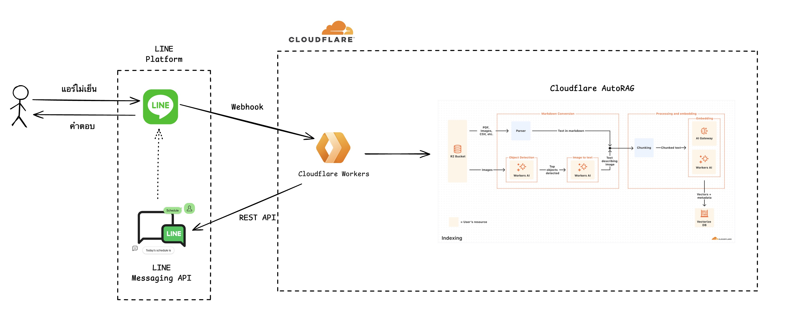

# LINE chatbot ช่างแอร์ด้วย Cloudflare Worker & AutoRAG

Chatbot ช่างแอร์ด้วย AutoRAG

Youtube: [LINE chatbot ด้วย Cloudflare AutoRAG - FAQ LLM project สำหรับคนใช้ LINE ทำงาน](https://youtu.be/ALKNEUiIjw4?si=cpSuY7mqS9RhGqrj)

Note - ไอตัว Doc เก็บไปนั่งดูได้นะครับ ผมได้มาจากพ่อแค่นั้นแหละ 555555

## Overview



1. User ส่งข้อมูลผ่าน LINE Official Account
2. LINE Official Account ส่งข้อมูลผ่าน Webhook ไปยัง Cloudflare Worker
3. Cloudflare Worker รับข้อมูลจาก LINE Official Account และส่งข้อมูลไปยัง AutoRAG
4. AutoRAG ตอบกลับข้อมูลกลับมาให้ Cloudflare Worker
5. Cloudflare Worker ส่งข้อมูลกลับไปยัง LINE Reply API via REST
6. LINE Official Account แสดงข้อมูลกลับมาให้ User

## Prerequisites

- Cloudflare account + AutoRAG setup
- LINE Official Account
- JS programming knowledge

## Setup

### Create type gen

```bash
cd ac-technician-consult-agent
npx wrangler types
```

### Deployment related

```bash
cd ac-technician-consult-agent
npm run deploy
```

### Add secret

Run this command and then insert value

```bash
cd ac-technician-consult-agent
npx wrangler secret put CHANNEL_ACCESS_TOKEN
```

## Other resources

- [Building GenAI Chatbot using Gemini and Firebase - ตั้งค่า LINE OA](https://codelab.line.me/codelabs/chatbot-x-gemini/index.html)
- [LINE Messaging API - Reply API](https://developers.line.biz/en/docs/messaging-api/sending-messages/)
- [Introducing AutoRAG: fully managed Retrieval-Augmented Generation on Cloudflare](https://blog.cloudflare.com/introducing-autorag-on-cloudflare/)
- [AutoRAG Doc](https://developers.cloudflare.com/autorag/)